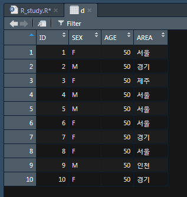

# [Ch.02-08] 데이터 프레임

- 데이터 프레임은 R에서 가장 중요한 자료형이다. 데이터 프레임은 행렬과 마찬가지의 모습을
  하고 있지만 행렬과 달리 다양한 변수, 관측치(observations), 범주 등을 표현하기 위해 특화되
  어있다.

- 데이터 프레임(Data Frame)은 처리할 데이터를 마치 엑셀의 스프레드시트와 같이 표 형태로 정리한 모습을 하고 있다. 데이터 프레임의 각 열에는 관측값의 이름이 저장되고, 각 행에는 매 관측 단위마다 실제 얻어진 값이 저장된다. 예를 들어, 다음 성적 데이터와 같은 모습이 데이터 프레임에 저장되는 데이터의 전형적인 예다.

  | 성명   | 국어 | 영어 |
  | ------ | ---- | ---- |
  | 홍길동 | 80   | 94   |
  | 김길동 | 97   | 100  |
  | 박길동 | 85   | 97   |


## data.frame( ) : 데이터 프레임 생성

- 데이터 프레임은 data.frame( )에 ‘컬럼 이름=데이터’ 형태로 데이터를 나열하여 생성한다.
- 데이터 프레임의 각 컬럼은 서로 다른 데이터 타입일 수 있다.

```R
data.frame(...,                     # value 또는 tag=value로 표현된 데이터 값
           stringsAsFactors = FALSE	# 주어진 문자열을 팩터로 저장할지 문자열로 저장할지를 지정
           )                        # 기본값은 FALSE. 인자를 지정하지 않으면 문자열은 팩터로 저장된다.

---- < example > ---------------------------------------------------------------

> ( d <- data.frame(x=c(1, 2, 3, 4, 5),
                    y=c(2, 4, 6, 8, 10)) )
  x  y
1 1  2
2 2  4
3 3  6
4 4  8
5 5 10


# 숫자 벡터 x, y에 팩터인 z 컬럼을 추가
# stringsAsFactor를 TRUE 로 지정하면 문자열이 팩터로 저장된다.
> ( d <- data.frame(x=c(1, 2, 3, 4, 5),
                    y=c(2, 4, 6, 8, 10),
                    z=c('M', 'F', 'M', 'F', 'M'),
                    stringsAsFactors = TRUE) )
  x  y z
1 1  2 M
2 2  4 F
3 3  6 M
4 4  8 F
5 5 10 M

> str(d)	# 데이터 프레임의 구조
'data.frame':	5 obs. of  3 variables:
 $ x: num  1 2 3 4 5
 $ y: num  2 4 6 8 10
 $ z: Factor w/ 2 levels "F","M": 2 1 2 1 2
```


만약 이미 정의된 데이터 프레임에서 컬럼 이름 colname에 데이터 y를 저장하고자 한다면 d$colname <- y 문법을 사용한다. 다음은 x 컬럼의 값을 1, 2, 3, 4, 5에서 6, 7, 8, 9, 10으로 바꾸는 예다.

```R
> d <- data.frame(x=c(1, 2, 3, 4, 5),
+                  y=c(2, 4, 6, 8, 10),
+                  z=c('M', 'F', 'M', 'F', 'M'))
> d$x
[1] 1 2 3 4 5
> d$x <- 6:10
> d
   x  y  z
1  6  2  M
2  7  4  F
3  8  6  M
4  9  8  F
5 10 10  M
```

위의 데이터 프레임 d에 기존에 없던 컬럼 w를 추가하고자 할 때도 같은 문법을 사용한다.

```R
> d$w <- c("A", "B", "C", "D", "E")
> d
   x  y  z  w
1  6  2  M  A
2  7  4  F  B
3  8  6  M  C
4  9  8  F  D
5 10 10  M  E
```

한 가지 특이할 만한 점은 w 컬럼에 저장한 데이터가 벡터므로 d$w의 데이터 타입 역시 chr(문자열 벡터)이라는 점이다. 이는 data.frame( )에 문자열 벡터를 지정할 때 stringsAsFactor를 지정하지 않으면 문자열이 팩터로 바뀌는 것과는 다른 점이다.

```R
> str(d)
'data.frame': 5 obs. of 4 variables:
$ x: int 6 7 8 9 10
$ y: num 2 4 6 8 10
$ z: Factor w/ 2 levels "F","M": 2 1 2 1 2
$ w: chr "A" "B" "C" "D" ...
```

데이터 프레임의 행 이름, 컬럼 이름은 각각 rownames( ), colnames( ) 함수로 지정할 수 있다.

```R
> (x <- data.frame(1:3))
  X1.3
1    1
2    2
3    3
> colnames(x) <- c('val')
> x
  val
1 1
2 2
3 3
> rownames(x) <- c('a', 'b', 'c')
> x
  val
a 1
b 2
c 3
```

또는 names( )를 사용해도 colnames( )와 같은 결과를 얻는다.


## 데이터 프레임 접근


데이터 프레임의 각 컬럼은 d$colname과 같이 컬럼 이름으로 접근할 수 있으며, 행이나 컬럼의 색인을 사용해서도 데이터에 접근할 수 있다.

```R
> d <- data.frame(x=c(1, 2, 3, 4, 5), y=c(2, 4, 6, 8, 10))
  x y
1 1 2
2 2 4
3 3 6
4 4 8
5 5 10
> d$x
[1] 1 2 3 4 5
> d[1, ]
  x y
1 1 2
> d[1, 2]
[1] 2
```

벡터로 색인을 지정하거나 제외할 행 또는 컬럼을 -로 표시할 수 있다.

```R
> d[c(1, 3), 2]
[1] 2 6
> d[-1, -2]
[1] 2 3 4 5
```

또는 컬럼 이름을 지정할 수도 있다.

```R
> d[, c("x", "y")]
   x  y
1  1  2
2  2  4
3  3  6
4  4  8
5  5 10
> d[, c("x")]
[1] 1 2 3 4 5
```

위 코드에서 d[, c(“x”)]로 x 컬럼만 선택했을 때 데이터 프레임의 일반적인 표 형태 출력이 아니라 벡터처럼 결과가 출력된 것을 볼 수 있다. 이는 컬럼의 차원이 1이 되면 반환 값이 해당 컬럼의 데이터 타입을 따르기 때문이다. 이러한 형 변환을 원치 않는다면 다음과 같이 drop=FALSE 옵션을 지정한다.

```R
> d[, c("x"), drop=FALSE]
  x
1 1
2 2
3 3
4 4
5 5
```

주어진 값이 벡터에 존재하는지를 판별하는 %in% 연산자와 데이터 프레임의 컬럼 이름을 반환하는 names( )를 이용하면 특정 컬럼만 선택하는 작업을 좀 더 손쉽게 할 수 있다. 예를 들어, 다음 코드는 a, b, c 컬럼이 있는 데이터 프레임에서 b, c 컬럼만 선택하는 경우다.

```R
> (d <- data.frame(a=1:3, b=4:6, c=7:9))
  a b c
1 1 4 7
2 2 5 8
3 3 6 9
> d[, names(d) %in% c("b", "c")]
  b c
1 4 7
2 5 8
3 6 9
```

반대로 ! 연산자를 사용해 특정 컬럼들만 제외해서 데이터를 선택할 수도 있다.

```R
> d[, !names(d) %in% c("a")]
  b c
1 4 7
2 5 8
3 6 9
```


## 유틸리티 함수

- 통상 R에서의 데이터 처리는 데이터 프레임을 기본 타입으로 하므로 데이터 프레임에 많은 양의 데이터가 저장된다. 따라서 작업 중 데이터 프레임을 화면에 출력하면 전체 데이터가 모두 출력되어 데이터를 읽기가 어렵다.
- 이 경우 데이터의 제일 앞부분만 살펴보는 데 head( )를, 뒷부분만 살펴보는 데 tail( )을 사용할 수 있다.


### head( ) : 데이터의 앞부분만 살펴보기

```R
> d <- data.frame(x=1:1000)

> head(d)
  x
1 1
2 2
3 3
4 4
5 5
6 6
```


### tail( ) : 데이터의 뒷부분만 살펴보기

```R
> d <- data.frame(x=1:1000)

> tail(d)
        x
995   995
996   996
997   997
998   998
999   999
1000 1000
```


### View( )

- View( )는 행렬과 같은 모습을 한 데이터를 손쉽게 살펴보기 위한 화면을 띄워 보여주는 함수다. 

```R
> ID <- c(1, 2, 3, 4, 5, 6, 7, 8, 9, 10)
> SEX <- c("F", "M", "F", "M", "M", "F", "F", "F", "M", "F")
> AGE <- c(50)
> AREA <- c("서울", "경기", "제주", "서울", "서울", "서울", "경기", "서울", "인천", "경기")

> d <- data.frame(ID, SEX, AGE, AREA)

> View(d)
```

- View(d) 실행 결과 화면

  
